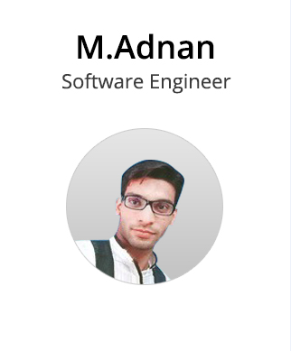

  
  
  

---

I'm a motivated, hard-working and work-oriented person who finds joy in new challenges and keep an eye out for them everyday. Ability to work well as a team member and exceptional work ethic. Desire to work in a professionally enriched environment for a challenging position utilizing creativity and a true desire to actively contribute which may enrich my skills and provide new horizons of excellence and personal development.
I'm a Computer Science graduate with an obsession with modern web technologies. I'm quite confident with Javascript, ES6, React, Angular and related technologies. Other than that I try to learn new techs everyday to grow my arsenal.

Open to commissions and collaborations: adnanshah9911@gmail.com

---

## Latest Projects

- [**Clique**](https://chrome.google.com/webstore/detail/clique-payments/nlgjlidmhmjpkbjdcgaclehcfinmkhnh), A chrome extension for QuickBooksOnline to pay bill, invoice etc using multiple gateways.

- [**KretaHub**](https://github.com/AdnanShah/KretaHub-ReactJs), KretaHub is a shipping web application which controls all the necessary shipping formalities required to ship a product.

- [**CodeCave**](https://github.com/AdnanShah/CodeCave-MEAN-Stack), CodeCave is an open source project inspired by some developers communities out there. The project was started as a semester project and can be consider as a started kit for any web based community or forum.
- [**Python-Recommendation-Engine**](https://github.com/AdnanShah/Python-Recommendation-Engine), An ecommerce recommendation engine which recommend items to user based on their preference.

---

## Experience

#### Software Engineer, [Prismpay](https://www.prismpay.com/)

##### June 2017 - (Currently Working) | Karachi

- Responsible for development of custom and interactive UI using modern technologies like JavaScript, Angular4, ReactJs and Jquery.

- Engaged in customer support for the existing code (bug fixing, enhancements to improve the existing solution).

- Designed and developed real time recommendation engine to recommend items to users based on there preferences using Python.

---

## Education

#### Computer Science, [Karachi University](http://www.uok.edu.pk/)

##### (2014 - 2018) | Karachi

#### Intermediate, [DJ Science College](https://en.wikipedia.org/wiki/D._J._Sindh_Government_Science_College)

##### (2012 - 2013) | Karachi

#### Matriculation, [Shan Grammar School](https://adnanshah.github.io/M-Adnan/)

##### (2011) | Karachi

---

### Languages & Frameworks

- Python
- Javascript Es6
- React JS
- Angular 2+
- Jquery

### Operating System

- Linux
- Windows

### Languages

- English
- Urdu

---
